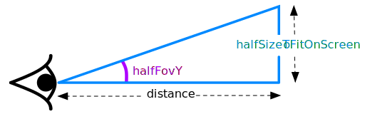

Title: WebGL 3D to 2D

This article is one in a [series of articles about WebGL](/). If you're
new to WebGL please [start at the beginning](webgl-fundamentals.org).

I had hoped it would be clear if you want to do 2D you can either directly
do 2D as many of the article do. You can also use 3D math but use an
orthographic projection. This is what many 3D game engines do when used
in their 2D mode. They just point the camera directly along either the Z
axis or the Y axis and use an [orthographic projection](webgl-3d-orthographic).
A side scroller might look down the Z axis. A top down view a like a map
might look down the Y axis.

If you want to do 3D you use a [perspective matrix](webgl-3d-perspective.html).

If you want to animate the transition lerping between the 2 seems to work

     const ortho = m4.orthographic(left, right, top, bottom, orthoZNear, orthZFar);
     const persp = m4.perspective(fov, aspect, perspZNear, perspZFar);
     const projection = [];
     for (let i = 0; i < 16; ++i) {
       projection[i] = lerp(ortho[i], persp[i], mixAmount);
     }

     function lerp(a, b, l) {
       return a + (b - a) * l;
     }

Where `mixAmount` is 0 when you want the orthographic view (2d-ish)
and `mixAmount` is 1 when you want the perspective view (3d) and you
can animate that between 0 and 1.

If you want the orthographic view match the perspective view you need
to choose `top`, `bottom`, `left`, `right` values that fit your app.
For transitioning between 2 different views (say first person on the ground
vs looking straight down) you can pick whatever settings you want.
But say you were looking down and just wanted to view to go from 3D to 2D
with the same view. In that case you need to pick a left, right, top,
bottom that matches the perspective view for a given number of units.
For top and bottom that's probably how ever many units fit vertically
the "ground" distance from the camera. In other words, if the ground
is 10 units away from the camera we need to compute how many units
of ground will be visible vertically on the screen.

Solving for `halfSizeToFitScreen` we get

    halfSizeToFitOnScreen = heightAboveGroundInTopView * Math.tan(fov / 2);

Which means we can set top, left, right, bottom as follows

    const aspect = gl.canvas.clientWidth / gl.canvas.clientHeight;
    const top = -halfSizeToFitOnScreen;
    const bottom = +halfSizeToFitOnScreen;
    const left = top * aspect;
    const right = bottom * aspect;

The other thing that changes is the [camera](webgl-3d-camera.html).
A common way to position a camera is using a `lookAt` function.

To look down

    const cameraPosition = [x, groundHeight + distanceAboveGround, z];
    const target = [x, groundHeight, z];
    const up = [0, 0, 1];
    const camera = someLookAtFunction(camearPosition, target, up);

You'd have a different set of `cameraPosition`, `target`, `up` for the 3d camera.
You can animate the transition between them by lerping those 3 variables.

    const eye = v3.lerp(orthoEye, perspEye, camMixAmount);
    const target = v3.lerp(orthoTarget, perspTarget, camMixAmount);
    const up = v3.lerp(orthoUp, perspUp, camMixAmount);

    const camera = m4.lookAt(eye, target, up);
    const view = m4.inverse(camera);
    const viewProjection = m4.multiply(projection, view);

Here's an example

{{{example url="../webgl-3d-to-2d.html" }}}

